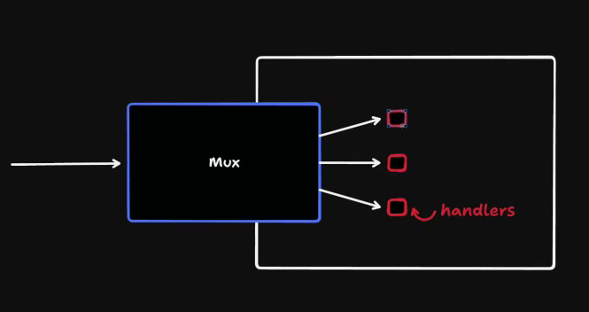
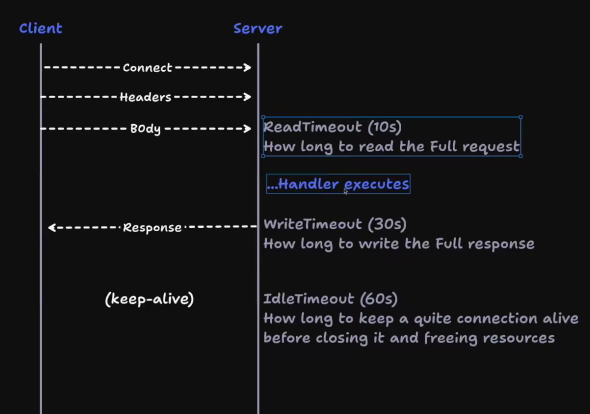

# Marketplace API

A production-oriented backend for a marketplace application built with Go. The project demonstrates industry-standard backend architecture, secure authentication, CRUD operations, asynchronous image processing, and scalable system design.

---

# Table of Contents

- [Overview](#overview)
- [Requirements](#requirements)
  - [Functional Requirements](#functional-requirements)
  - [Non-Functional Requirements](#non-functional-requirements)
- [High-Level Architecture](#high-level-architecture)
- [Design Approach](#design-approach)
- [Domain Model](#domain-model)
- [Project Goals](#project-goals)
- [Getting Started](#getting-started)
- [Build](#build)

---

# Overview

The Marketplace API allows users to create and manage product listings with image uploads and categories. The system is designed with scalability, reliability, and maintainability in mind, following backend engineering best practices.

---

# Requirements

## Functional Requirements

### Authentication

- User registration
- User login
- Secure password authentication

### Listings

- Create listing
- Update listing
- Delete listing
- Retrieve listings
- Only the listing owner can update or delete a listing

### Categories

- Create category
- Update category
- Delete category
- List categories

### Images

- Upload product images
- Associate images with listings

---

## Non-Functional Requirements

### Security

- Password hashing
- Secure authentication
- Secure file uploads
- Authorization checks for protected resources

### Privacy

- Strip GPS (EXIF) metadata from uploaded images before storage

### Reliability

- Worker crash recovery
- Job reclamation
- Exponential backoff for retries

### Availability

- Highly available API and background workers

### Performance

- Efficient image uploads
- Optimized download performance
- Caching where appropriate

### Scalability

- Horizontally scalable API servers
- Horizontally scalable background workers

### Portability

- Object storage abstraction
- Easily switch between providers (e.g. Cloudflare R2, AWS S3, MinIO) with minimal configuration changes

### Maintainability

- Modular project structure
- Version-controlled database migrations
- Clean separation of concerns

### Observability

- Structured logging
- Request correlation IDs
- Improved debugging and traceability

---

# High-Level Architecture

```text
                 +----------------+
                 |    Browser     |
                 +----------------+
                         |
                    HTTP Requests
                         |
                         ▼
               +------------------+
               |    Go API Server |
               +------------------+
                  |            |
                  |            |
          PostgreSQL      Object Storage
                               |
                               |
                      Cloudflare R2 / S3
```

---

# Design Approach

This project follows a **Data-First** software design approach.

## Data-Driven Design (DDD - Data First)

The application primarily revolves around managing entities through CRUD operations.

Examples include:

- Marketplace
- Inventory systems
- Blog platforms
- CMS applications

The design process begins by identifying the core entities and modeling them in the database.

### When to use

- CRUD-heavy applications
- Admin dashboards
- Inventory management
- Content management systems

---

## Behavior-Driven Design (Domain-Driven Design)

For applications with complex business rules, it is often better to design behaviors first.

Examples include:

- Order processing
- Payment systems
- Booking platforms
- Banking systems

In these systems, business logic is modeled before persistence.

---

# Domain Model

## User

| Field | Type |
|--------|------|
| id | UUID |
| name | string |
| email | string |
| password | string (hashed) |

---

## Listing

| Field | Type |
|--------|------|
| id | UUID |
| title | string |
| description | text |
| price | decimal |
| city | string |
| status | enum |
| user_id | UUID |
| category_id | UUID |

---

## Image

> Introduced once image uploads become a requirement.

| Field | Type |
|--------|------|
| id | UUID |
| listing_id | UUID |
| object_key | string |

---

## Category

| Field | Type |
|--------|------|
| id | UUID |
| name | string |

---

# Project Goals

- Clean REST API design
- Production-ready authentication
- Secure file uploads
- Background processing
- Scalable architecture
- Maintainable codebase
- Cloud storage abstraction
- Structured logging and observability

---

# Getting Started

Run the API server locally (from project root):

```bash
go run ./cmd/api
```

Run the websocket server locally (if used):

```bash
go run ./cmd/ws
```

---

# Build

Build the API server binary:

```bash
go build -o bin/api ./cmd/api
```

Build the websocket server binary:

```bash
go build -o bin/ws ./cmd/ws
```

## Concepts

`MUX`: : DefaultServeMux used by HandlerFunc with is global that is the bad practice

 